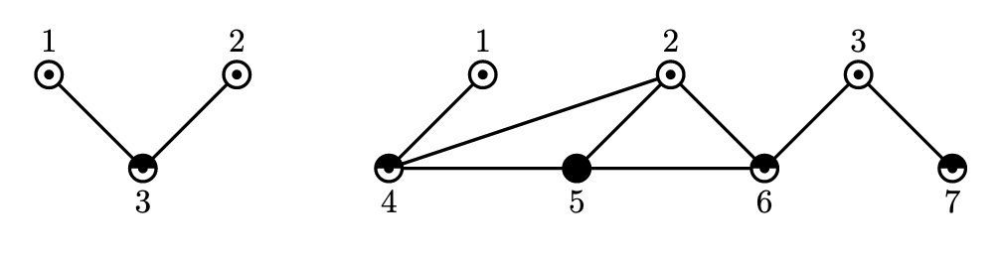

# Лабораторная работа по графам
PDF: **[s3-01-lab-graph.pdf](s3-01-lab-graph.pdf)** 

## Задача A. Гамильтонов цикл в полном графе
> Ограничение по времени: 1 секунды  
  Ограничение по памяти: 256 мегабайт  

Дан граф из N вершин, в котором степень любой вершины не меньше ᴺ⁄₂. Ваша задача — найти
гамильтонов цикл.

### Формат входных данных
На первой строке входных данных записано целое число N (3 ≤ N ≤ 4 000) — количество вершин
в графе. На следующих N строках записана матрица смежности. Т.к. матрица смежности симметрична, а на диагонали всегда стоят нули, на i-й строке записаны i-1 символ — нули и единицы. Если j-й символ i-й строки равен единице, значит есть ребро между вершинами i и j.  
Гарантируется, что в графе есть гамильтонов цикл и, что степень каждой вершины не меньше ᴺ⁄₂.

### Формат выходных данных
Выведите перестановку из N чисел — номера вершин в порядке гамильтонова цикла.

### Пример
| стандартный ввод | стандартный вывод
| --- | --- |
| 4  1 11 101 | 1 2 3 4 |

**[Решение/Solution](src/a.cpp)**

## Задача B. Поиск гамильтонова цикла в условиях теоремы Хватала
> Ограничение по времени: 1 секунды  
  Ограничение по памяти: 256 мегабайт  

Дан граф из N вершин, для которого выполняется условие теоремы Хватала, то есть, в отсортированной последовательности его степеней вершин dₖ для любого k < n/2 верно либо dₖ > k, либо dₙ₋ₖ ≥ n-k. Ваша задача — найти гамильтонов цикл.

### Формат входных данных
На первой строке входных данных записано целое число N (3 ≤ N ≤ 100) — количество вершин
в графе. На следующих N строках записана матрица смежности. Т.к. матрица смежности симметрична, а на диагонали всегда стоят нули, на i-й строке записаны i-1 символ — нули и единицы. Если j-й символ i-й строки равен единице, значит есть ребро между вершинами i и j.

### Формат выходных данных
Выведите перестановку из N чисел — номера вершин в порядке гамильтонова цикла.

### Пример
| стандартный ввод | стандартный вывод
| --- | --- |
| 4  1 11 101 | 1 2 3 4 |

**[Решение/Solution](src/b.cpp)**

## Задача C. Интерактивная восточная сказка
> Ограничение по времени: 1 секунды  
  Ограничение по памяти: 256 мегабайт  

У злого волшебника Джафара много ламп, которые он холит и лелеет, и любит очень сильно, но
из каждой пары ламп он всё же может выбрать одну, которую он любит даже сильнее, чем другую.  
Он захотел расставить их в ряд так, чтобы когда он будет идти вдоль этого ряда каждая следу-
ющая лампа была им более любима, чем предыдущая.  
Новому слуге Джафара поручено это сделать, но... он не знает предпочтений Джафара!  
Про любую пару ламп можно спросить у волшебника, какую он любит больше, но нельзя излишне
навязываться с вопросами (отрубание головы еще никто не отменял).  
Помогите слуге расположить лампы или узнать, что это невозможно (и сброситься со скалы).

### Формат входных данных
Первое число, которое будет передано во входном потоке, — N (1 ≤ N ≤ 1000), количество ламп.  
Затем на каждый вопрос слуги, который ваша программа выведет в выходной поток, во входном
потоке будет дан ответ — слово "YES", если лампа Yᵢ более любима чем Xᵢ, и слово "NO", если Xᵢ более любима чем Yᵢ.  
Заметьте, что отношение «более любима чем» не обязано быть транзитивным.

### Формат выходных данных
В выходной файл вы можете выводить запросы. Каждый вопрос — одна строчка с тремя числами 1, Xᵢ, Yᵢ (1 ≤ Xᵢ,Yᵢ ≤ N; Xᵢ≠Yᵢ). Вы можете задать не более 10 000 вопросов.  
В последней строчке выведите число 0, а затем N целых числел от 1 до N — мера ламп в порядке, в котором их надо расставить. Если же расставить лампы невозможно, выведите (N + 1) ноль.

### Пример
| стандартный ввод | стандартный вывод
| --- | --- |
| 3  YES  NO |  1 1 2  1 1 3  0 3 1 2 |

**[Решение/Solution](src/c.cpp)**

## Задача D. Цикл в турнире
> Ограничение по времени: 1 секунды  
  Ограничение по памяти: 256 мегабайт  

Найдите гамильтонов цикл в полном ориентированном сильносвязном графе.

### Формат входных данных
В первой строке входных данных содержится число n (1 ≤ n ≤ 1000) — число вершин в графе.  
Далее следует n строк имеющих длину, соответственно, 0, 1, 2, …, n − 1. В i-й из этих строк j-й символ равняется 1, если ребро ведет из вершины i в вершину j, и 0, если из вершины j в вершину i.

### Формат выходных данных
Выведите номера вершин в порядке их следования в найденном гамильтоновом цикле.

### Пример
| стандартный ввод | стандартный вывод
| --- | --- |
| 3  1 01 | 1 3 2 |

**[Решение/Solution](src/d.cpp)**

## Задача E. Код Прюфера по дереву
> Ограничение по времени: 2 секунды  
  Ограничение по памяти: 256 мегабайт  

Дано дерево из n вершин. Выведите код Прюфера этого дерева.

### Формат входных данных
В первой строке содержится число n (3 ≤ n ≤ 10⁵) — число вершин в дереве. Следующие n-1 строк содержат описание ребер дерева. Каждая строка содержит два числа uᵢ и vᵢ (1 ≤ uᵢ, vᵢ ≤ n) — концы i-го ребра.

### Формат выходных данных
Выведите n-2 чисел p₁, …, pₙ₋₂ — код Прюфера заданного дерева.

### Пример
| стандартный ввод | стандартный вывод
| --- | --- |
| 5 1 2 2 3 4 3 3 5 | 2 3 3 |

**[Решение/Solution](src/e.cpp)**

## Задача F. Дерево по коду Прюфера
> Ограничение по времени: 2 секунды  
  Ограничение по памяти: 256 мегабайт  

Дан код Прюфера некоторого дерева. Восстановите это дерево.

### Формат входных данных
В первой строке содержится число n (3 ≤ n ≤ 10⁵) — число вершин в дереве. В следующей строке содержится n-2 числа p₁, …, pₙ₋₂ (1 ≤ pᵢ ≤ n) — код Прюфера дерева.

### Формат выходных данных
Выведите n-1 строк, описывающие ребра дерева. Каждая строка должна содержать два числа u и v — концы очередного ребра.

### Пример
| стандартный ввод | стандартный вывод
| --- | --- |
| 5 2 3 3 | 1 2 2 3 4 3 3 5 |

**[Решение/Solution](src/f.cpp)**

## Задача G. Раскраска нечетного графа
> Ограничение по времени: 1 секунды  
  Ограничение по памяти: 256 мегабайт  

Вам дан неориентированный связный граф с нечетным числом вершин. Степень вершины — это количество ребер, инцидентных этой вершине. В заданном графе степень каждой вершины не превосходит нечётного числа k. Ваша задача — раскрасить вершины графа в k цветов, чтобы цвета двух любых соединенных ребром вершин были различны.  
На рисунке приведены два примера графов. В первом 3 вершины, а во втором 7 вершин. В обоих графах степень каждой вершины не превосходит 3 и их вершины раскрашены в три различных цвета, показанных на картинке как  ‘⦿’, ‘◓’ и ‘●’.

### Формат входных данных
Первая строка ввода содержит два целых числа n и m, где n — число вершин в графе (3 ≤ n ≤ 9999, n нечетно), а m — число ребер в графе (2 ≤ m ≤ 100 000). Следующие m строк описывают ребра графа, каждое ребро описывается двумя целыми числами aᵢ и bᵢ (1 ≤ aᵢ,bᵢ ≤ n, aᵢ≠bᵢ) — номера вершин, соединенных ребром.  
Граф во вводе связен, любые две вершины соединены не более чем одним ребром, нет ребра, соединяющего вершину саму с собой.

### Формат выходных данных
На первой строке следует вывести число k — минимальное нечетное целое число, большее или равное степени любой вершины графа. Далее выведите n строк, i-я строка должна содержать единственное число cᵢ (1 ≤ cᵢ ≤ k) — цвет i-й вершины.  
Цвета соседних вершин должны быть различны.  
Если подходящих раскрасок несколько, выведите любую из них.  
Из курса дискретной математики известно, что искомая раскраска точно сущестует для графа
из условия.

### Примеры
| стандартный ввод | стандартный вывод
| --- | --- |
| 3 2 1 3 3 2 | 3 1 1 2 |
| 7 8 1 4 4 2 2 6 6 3 3 7 4 5 5 6 5 2 | 3 1 1 1 2 3 2 2 |

**[Решение/Solution](src/g.cpp)**

## Задача H. Хроматический многочлен
> Ограничение по времени: 1 секунды  
  Ограничение по памяти: 256 мегабайт  

Задан неориентированный граф. Выведите его хроматический многочлен.

### Формат входных данных
Первая строка ввода содержит два целых числа n и m (1 ≤ n ≤ 10, 0 ≤ m ≤ 30) — количество вершин и ребер в графе.  
Следующие m строк содержат описание ребер графа, i-я строка содержит два целых числа uᵢ и vᵢ — концы i-го ребра.  
Любые две вершины соединены не более чем одним ребром, никакое ребро не соединяет вершину с собой.

### Формат выходных данных
На первой строке выведите число d — степень хроматического многочлена p_{G(t)} = p_{d}tᵈ + p_{d-1}tᵈ⁻¹ + … + p₁t + p₀.  
На второй строке выведите коэффициенты многочлена p_{d}, p_{d-1}, …, p₁, p₀.

### Пример
| стандартный ввод | стандартный вывод
| --- | --- |
| 4 5 1 2 1 3 2 3 2 4 3 4 | 4 1 -5 8 -4 0 |

**[Решение/Solution](src/h.cpp)**