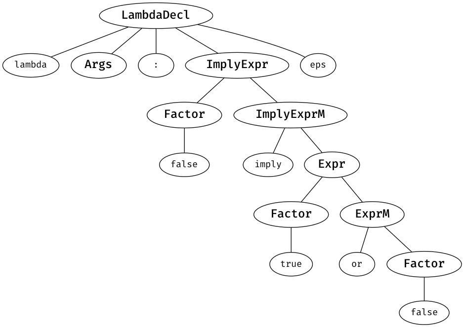
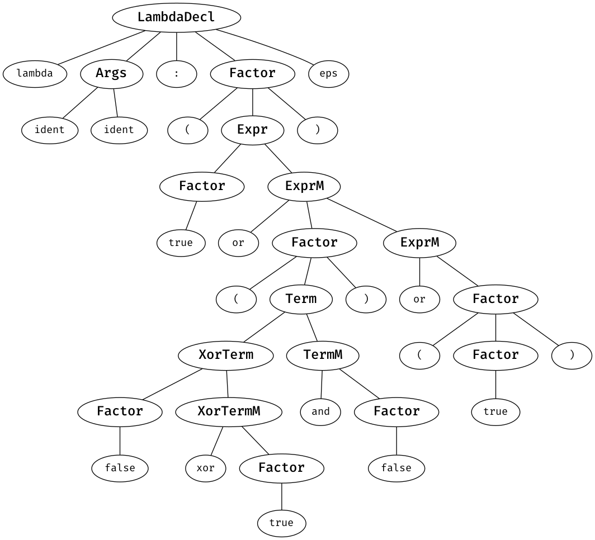

# Лабораторная работа No2. Ручное построение нисходящих синтаксических анализаторов

## Вариант 8. Описание лямбда функции в Python
Описание лямбда функции в Python. Описание начинается ключевым словом “lambda”, далее идет множество аргументов через запятую, двоеточие, выражение. Используйте логические и/или арифметические операции.  

Используйте один терминал для всех имен переменных. Используйте один терминал для ключевых слов lambda и т.п. (не несколько ‘l’, ‘a’, ‘m’ и т. д.).  

Пример: `lambda n : n + 2`

Модификация: -> и xor.

## Грамматика

Зададим КС-грамматику для лямбда-функций с логическими операций внутри выражений.  

```
LambdaDecl -> lambda Args : ImplyExpr

// Либо 0 аргументов, либо 1 аргумент и дальше 0 или более аргументов
Args    -> eps
Args    -> ident OptArgs
OptArgs -> eps
OptArgs -> , ident OptArgs

// Булевы выражения с поддержкой imply/or/and/xor/not
ImplyExpr -> ImplyExpr imply Expr
ImplyExpr -> Expr
Expr   -> Expr or Term
Expr   -> Term
Term   -> Term and XorTerm
Term   -> XorTerm
XorTerm -> XorTerm xor Factor
XorTerm -> Factor
Factor -> false
Factor -> true
Factor -> ident
// not можно повторять один или более раз
Factor -> not Factor
Factor -> ( ImplyExpr )
```

### Нетерминалы

| Нетерминал | Значение |
| --- | --- |
| LambdaDecl | Полное объявление лямбда-функции |
| Args | 0 или более аргументов |
| OptArgs | Продолжение 1 или более аргументов |
| ImplyExpr | Выражение с импликацией |
| Expr | Выражение в лямбда-функции |
| Term | "Слагаемое" в выражении |
| XorTerm | Слагаемое с xor'ом. |
| Factor | "Множитель" в выражении |

### Преобразование

Устраним левую рекурсию в грамматике.

```
LambdaDecl -> lambda Args : ImplyExpr

Args    -> ident OptArgs
Args    -> eps
OptArgs -> , ident OptArgs
OptArgs -> eps

ImplyExpr -> Expr ImplyExprM
ImplyExprM -> imply Expr ImplyExprM
ImplyExprM -> eps
Expr   -> Term ExprM
ExprM  -> or Term ExprM
ExprM  -> eps
Term   -> XorTerm TermM
TermM  -> and XorTerm TermM
TermM  -> eps
XorTerm -> Factor XorTermM
XorTermM -> xor Factor XorTermM
XorTermM -> eps
Factor -> false
Factor -> true
Factor -> ident
Factor -> not Factor
Factor -> ( ImplyExpr )
```

### FIRST, FOLLOW

| Нетерминал | FIRST | FOLLOW |
| --- | --- | --- |
| LambdaDecl | lambda | $ |
| Args | ident, eps | : |
| OptArgs | **','**, eps | : |
| ImplyExpr | ident, false, true, not, ( | ), $ |
| ImplyExprM | imply, eps | ), $ |
| Expr | ident, false, true, not, ( | imply, ), $ |
| ExprM | or, eps | imply, ), $ |
| Term | ident, false, true, not, ( | imply, or, ), $ |
| TermM | and, eps | imply, or, ), $ |
| XorTerm | ident, false, true, not, ( | imply, or, and, ), $ |
| XorTermM | xor, eps | imply, or, and, ), $ |
| Factor | ident, false, true, not, ( | imply, or, and, xor, ), $ |

## Примеры дерева разбора

Для визуализации можно использовать скрипт [draw.py](./draw.py), который запустит анализатор на Go и после отрисует дерево разбора при помощи [graphviz](https://graphviz.org/).

1. `lambda: False imply True or False`  


2. `lambda a, b: (True or (False xor True and False) or (True))`  
