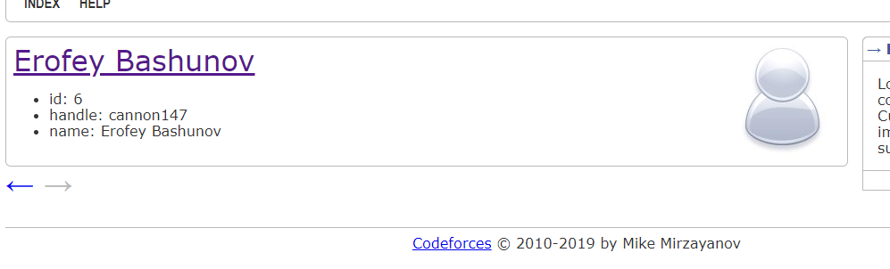
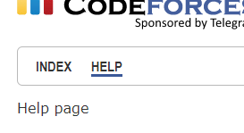
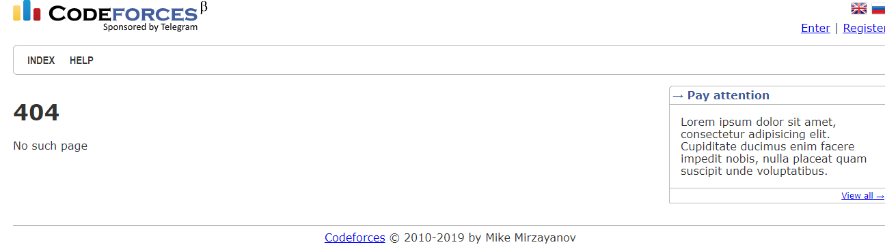

# Intro to Freemarker Template Engine
## Tasks
### Task 1
Улучшите страницу профиля пользователя /user?handle=?. Результат должен быть похож на такой:  
  
  
Картинку стоит отображать всем одинаковую (можно взять с https://userpic.codeforces.com/no-title.jpg). Стрелочки должны функционировать и переводить на предыдущего по списку или следующего пользователя (если есть). Если такого нет - то стрелка должна стать серой и перестать быть ссылкой (как на скриншоте выше).

Сделайте, чтобы в эту страницу можно было альтернативно передавать и user_id, то есть чтобы работали ссылки вида /user?user_id=3 Ссылки на стрелочках надо оставлять в старом стиле (по handle). Поменяйте FreemarkerServlet#getData, чтобы если параметр заканчивается на \_id и является корректным числом, то он бы складывался в data не как строка, а как число типа long. Это поможет и в других заданиях сократить код.

### Task 2
Сделайте, чтобы подчеркивался текущий пункт в меню. Подумайте, что надо доложить в data, чтобы была возможность такое сделать. Минимизируйте дублирование кода в шаблонах вокруг menu items. 
  
  

### Task 3
Исправьте FreemarkerServlet, чтобы по заходу на страницу без пути (по-умолчанию) и на страницу / осуществлялся мягкий (временный) редирект на /index.

Сделайте, чтобы по переходу по неожиданной ссылке отображалась 404-страница (и статус должен быть 404).  
  
  

### Task 4
Поддержите новый объект предметной области Post. У Post должно быть четыре поля id (long), title (String), text (String) и user_id (long). Создайте в системе по аналогии с User серию постов с разумными содержаниями (модифицируйте DataUtil). Используя вашу разметку из второго ДЗ отобразите на главной список всех постов в обратном порядке (от последнего к первому). Если длина text превышает 250 символов, то обрезайте его и используйте символ многоточия в конце (сокращайте длинные тексты). Страницу со списком пользователей перенесите в отдельную страницу /users. Измените её разметку так, чтобы использовать вёрстку таблицы из второго ДЗ для их отображения. Добавьте в меню пункт USERS.

### Task 5
В сайдбаре в блоках Information в сайдбаре тоже отображайте тексты постов (тоже не более 250 символов). Фразу Information замените на “Post #?” (его id). По ссылке View all уводите на страницу /post?post_id=?, на которой должен быть уже один не сокращённый пост. Таким образом, посты у вас будут отображаться на двух страницах (/index и /post?post_id=?). Не допускайте copy-paste: они обе должны пользоваться одним макросом отображения одного поста. На странице с одним постом текст поста сокращать не надо (ваш макрос должен поддерживать как сокращенный способ отображения, так и полный).

Добавьте в профиль пользователя количество его постов ссылкой на новую страницу /posts?user_id=?, по которой осуществляется переход на список всех постов пользователя. Она должна выглядеть совсем как главная, но фильтровать посты по заданному пользователю. Вам надо снова переиспользовать макрос для отображения постов.

### Task 6
Добавьте пользователю свойство color (как цвет на Codeforces), которое должно быть enum с одним из значений: {RED, GREEN, BLUE}. Измените userlink, чтобы он отображал
пользователей по окрашенному хэндлу (прям как на Codeforces). То есть уберите подчеркивание, поменяйте чуток шрифт, навесьте правильный цвет в зависимости от color. Старый режим тоже сохраните, сделав дополнительный параметр у userlink (назовите его nameOnly).
Используйте старый режим для отображения текущего залогинённого пользователя в хедере. В остальных местах теперь отображайте пользователя в новом стиле. Напоминаем, что аутентификация на сайте поддерживается в игрушечном режиме через передачу параметра ?logged_user_id=.
